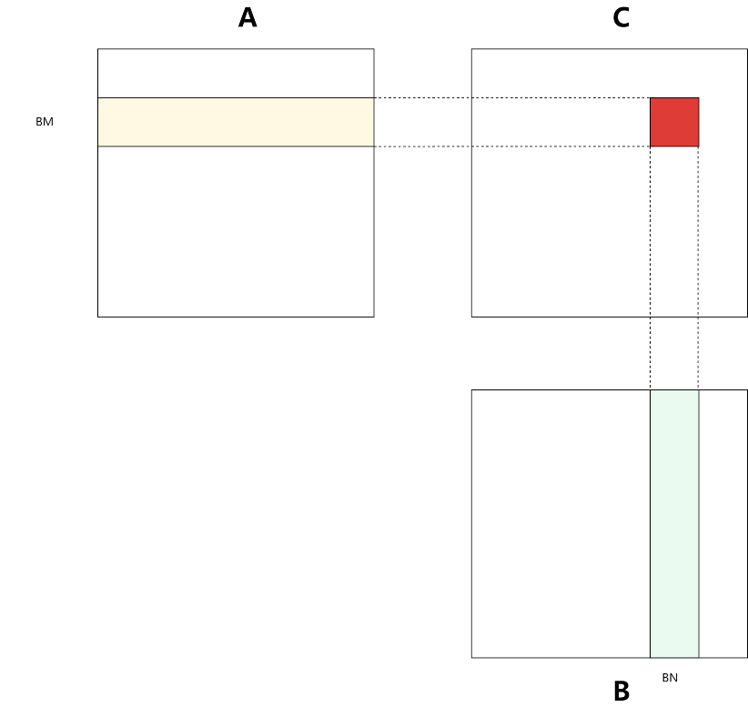
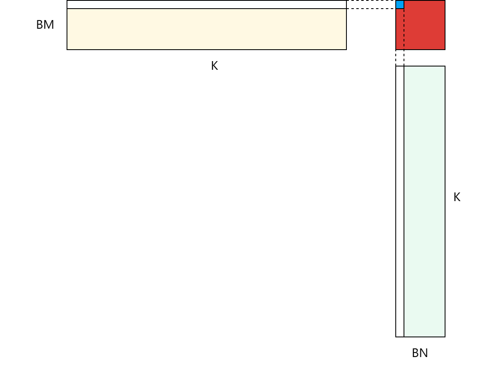
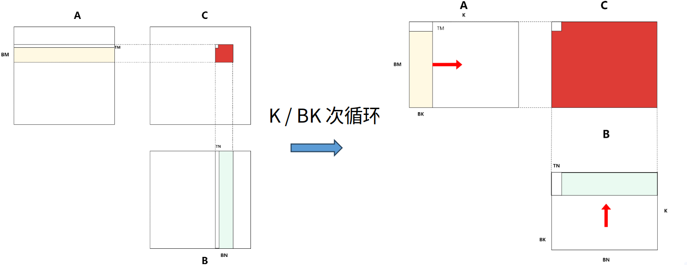
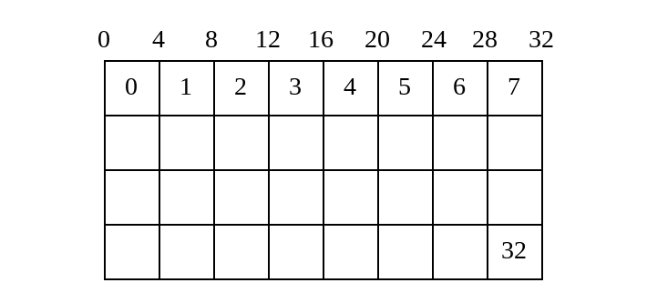
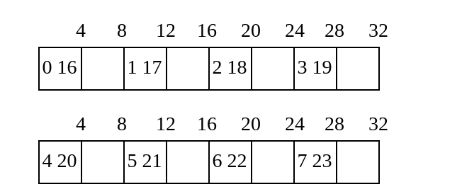
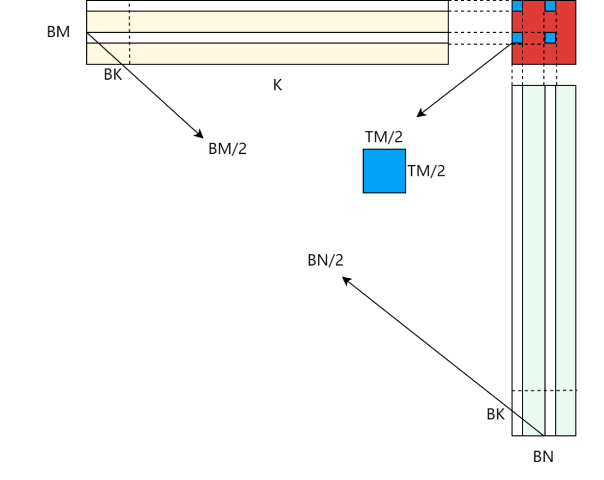
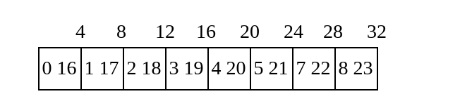

## GEMM 的CUDA实现与优化技巧

## 1. 线程划分和分块策略

==朴素划分==

``` c
dim3 blockSize(BM, BN)
dim3 gridSize((M + BM - 1) / BM, (N + BN - 1) / BN)
```




如图，每个线程块负责计算 BM * BN 大小的结果矩阵。朴素的线程划分应该是线程块内的每个线程负责计算一个元素，也就是每个线程块包含 BM * BN 个线程。



这种线程划分的情况下，每个线程每次计算都需要从 Global Memory 中加载数据，

$计算访存比 = \frac{2k}{2k} = 1$

没有有效的数据复用。因此这种情况下，访存延迟成为了算法最大的性能瓶颈。

==矩阵分块==

一个很有效的策略是使用 Shared Memory 来暂存线程块需要的数据，线程块通过分享 Shared Memory 的数据，大大提高了数据复用率。

```c
BM = BN = 128
BK = TM = TN = 8
dim3 blockSize(BM / TM, BN / TN)
dim3 gridSize((M + BM - 1) / BM, (N + BN - 1) / BN)
```

重新划分了线程任务，每个线程块负责的任务保持不变，每个线程负责 TM * TN 大小的结果矩阵。



为了引入 Shared Memory 暂存数据，但是一次性存储 BM * K + BN * K 的空间，是一个不小的负担。我们分成 K / BK 次循环来计算结果，这样每次循环只需要 BM * BK + BN * BK  的 shared memory 空间。

每个线程只需要负责加载 $\frac{(BM + BN) * BK}{\frac{BM}{TM} * \frac{BN}{TN}} = mem$ 个元素。

$计算访存比 = \frac{2 TM * BK * TN }{mem} = \frac{BM * BN}{2(BM + BN)} $

为了降低计算访存比，我们可以增大 BM 、BN ， 但是会受限于 Shared Memory 的大小。

还有需要注意的是，增大TM 、TN可以减少线程块的线程数量，增大线程的计算密度，有助于降低调度和管理开销。


## 2. 解决Bank Conflict

根据上面的线程分布，每个线程在每个循环内的工作是：

1. 从主存加载4个A矩阵元素和4个矩阵元素，并存储到 共享内存数组 s_a 和 s_b; （ldg + sts）
2. 从共享内存中读取数据 TM * BK 个A矩阵元素 以及 TN * BK 个元素；(lds)
3. 计算并累加结果矩阵 r_c。

``` c
const int tid = ty * blockDim.x + tx;

__shared__ float s_a[BM][BK];
__shared__ float s_b[BK][BN];

int load_a_smem_m = tid >> 1;           //  tid / 2
int load_a_smem_k = (tid & 1) << 2;     //  (tid % 2) * 4
int load_b_smem_k = tid >> 5;           //  tid / 32
int load_b_smem_n = (tid & 31) << 2;    //  (tid % 32) * 4

int load_a_gmem_m = by * BM + load_a_smem_m;
int load_b_gmem_n = bx * BN + load_b_smem_n;

// block内的线程分工把数据加载到shared memory中，即s_a、s_b
int load_a_gmem_k = bk * BK + load_a_smem_k;
int load_a_gmem_addr = OFFSET(load_a_gmem_m, load_a_gmem_k, K);
// FLOAT4(s_a[load_a_smem_m][load_a_smem_k]) = FLOAT4(A[load_a_gmem_addr]);

// 只在边界情况下进行检查，避免所有加载都进行边界判断
if (load_a_gmem_k + 3 < K && load_a_gmem_m < M) {
    FLOAT4(s_a[load_a_smem_m][load_a_smem_k]) = FLOAT4(A[load_a_gmem_addr]);
} else {
    // printf("Thread %d: load_a_gmem_k = %d, load_a_gmem_m = %d, load_a_gmem_addr = %d\n", tid, load_a_gmem_k, load_a_gmem_m, load_a_gmem_addr);
    float4 a_val;
    a_val.x = (load_a_gmem_m < M && load_a_gmem_k < K) ? A[load_a_gmem_addr] : 0.0f;
    a_val.y = (load_a_gmem_m < M && load_a_gmem_k + 1 < K) ? A[load_a_gmem_addr + 1] : 0.0f;
    a_val.z = (load_a_gmem_m < M && load_a_gmem_k + 2 < K) ? A[load_a_gmem_addr + 2] : 0.0f;
    a_val.w = (load_a_gmem_m < M && load_a_gmem_k + 3 < K) ? A[load_a_gmem_addr + 3] : 0.0f;
    FLOAT4(s_a[load_a_smem_m][load_a_smem_k]) = a_val;
}

int load_b_gmem_k = bk * BK + load_b_smem_k;
int load_b_gmem_addr = OFFSET(load_b_gmem_k, load_b_gmem_n, N);
// FLOAT4(s_b[load_b_smem_k][load_b_smem_n]) = FLOAT4(B[load_b_gmem_addr]);


if (load_b_gmem_n + 3 < N && load_b_gmem_k < K) {
    FLOAT4(s_b[load_b_smem_k][load_b_smem_n]) = FLOAT4(B[load_b_gmem_addr]);
} else {
    float4 b_val;
    b_val.x = (load_b_gmem_n < N && load_b_gmem_k < K) ? B[load_b_gmem_addr] : 0.0f;
    b_val.y = (load_b_gmem_n + 1 < N && load_b_gmem_k < K) ? B[load_b_gmem_addr + 1] : 0.0f;
    b_val.z = (load_b_gmem_n + 2 < N && load_b_gmem_k < K) ? B[load_b_gmem_addr + 2] : 0.0f;
    b_val.w = (load_b_gmem_n + 3 < N && load_b_gmem_k < K) ? B[load_b_gmem_addr + 3] : 0.0f;
    FLOAT4(s_b[load_b_smem_k][load_b_smem_n]) = b_val;
}
```

==sts阶段== ：每个线程负责加载数据，对应的位置分别是:

```c
s_a[tid / 2][(tid % 2) * 4 : (tid % 2 + 1) * 4]
s_b[tid / 32][(tid % 32) * 4 : (tid % 32 + 1) * 4]
```



如图，我们把**s_a数组**的内存按照每行32bytes进行重排，注意一个warp总共32个线程访问的内存空间。实现中使用了float4类型来传输数据，每个warp同时访问了4 * 32 * 4 bytes的空间。实际上，transaction会通过合并内存访问，分成四次访问，并不会出现实际意义的bankconflict导致的性能下降。

其实，我们把**s_b数组**的内存按照每行32bytes进行重排，示意图和上图是完全一致的。在CUDA的内存访问机制中，sts阶段不会出现bankconflict。

==lds阶段== ：每个线程每个循环内需要从共享内存中加载的数据

``` c++
// 每个线程计算TM * TN 子矩阵的结果，并存储到r_c数组寄存器里
#pragma unroll
for (int k = 0; k < BK; k++) {
    #pragma unroll
    for (int m = 0; m < TM; m++) {
        #pragma unroll
        for (int n = 0; n < TN; n++) {
       		r_c[m][n] += s_a[ty * TM + m][k] * s_b[k][tx * TN + n];     //注意坐标的计算
        }
    }
}
```

计算阶段，实际上是分别从 s_a 读取一个长度为 TM 的列向量 以及 从s_b读取一个长度为 TN 的行向量，将这两个向量求外积并累加。需要注意的是，根据现有的参数，TM = TN = 8，而CUDA最大支持LDS.128，也就说从s_b数组中加载数据需要起码两次。

- s_a 数组访问的数据不是连续的，肯定会出现bankconflict.

  懒得画了，说实话由于一个warp只加载了2 * 8 个数据，即使出现bankconflict也无所谓。

  也就是 tid 0 - 15 会和 tid [16 - 31] 对应在 bank [0, 8, 16, 24] 上产生bankconflict.

- s_b 数组访问的数据同样是不连续的，是间断的，也是存在着bankconflict.

  

  这里只给出了某一行数据的前半行数据（0~64）访问情况，而且是LDS.128前四个数据的时候，可以看到warp内线程存在着[0 , 4, 8, 12]的bankconflict。同时，bank 4-8 等却被浪费了。


### 重新排布数据

```c++
__shared__ float s_a[BK][BM];   // s_a逆转过来，以便取数据计算时可以连续取值
__shared__ float s_b[BK][BN];


#pragma unroll
for (int tk = 0; tk < BK; tk++) {

    // 从共享内存取出两个向量
    FLOAT4(r_comp_a[0]) = FLOAT4(s_a[tk][ty * TM / 2]);
    FLOAT4(r_comp_a[4]) = FLOAT4(s_a[tk][ty * TM / 2 + BM / 2]);
    FLOAT4(r_comp_b[0]) = FLOAT4(s_b[tk][tx * TN / 2]);
    FLOAT4(r_comp_b[4]) = FLOAT4(s_b[tk][tx * TN / 2 + BN / 2]);

    // 计算外积，注意这里的矩阵内存位置不是连续的，不能直接写回C
    #pragma unroll
    for (int tm = 0; tm < TM; tm++) {
        #pragma unroll
        for (int tn = 0; tn < TN; tn++) {
            r_c[tm][tn] += r_comp_a[tm] * r_comp_b[tn];
        }
    }

}
```

- s_a存储布局调整，使得lds阶段读取连续的数据；
- 每个线程计算的结果矩阵位置发生改变，有四个小矩阵组成。



在这种情况下，bankconflict完全得到解决，我们以s_a的访问为例：

``` c++
FLOAT4(r_comp_a[0]) = FLOAT4(s_a[tk][ty * TM / 2]);
```

tid 0-15 只访问 bank [0-3] ，访问地址一致直接合并了。tid 16-31 访问了 bank [4-7] ，也是合并了。为数不多的bankconflict也被解决了。

我们再来看看s_b的访问情况：

``` c++
FLOAT4(r_comp_b[0]) = FLOAT4(s_b[tk][tx * TN / 2]);
```



一个warp总共需要访问64 bytes的空间，$s_a[tk][0:32 * Tn / 2]$ ，这里只展示了前一半。这些内存访问会被合并成连续的内存访问，不存在bank conflict问题了。


## Double Buffering

为了进一步减少内存访问带来的延迟，可以使用双倍缓存来提前读取数据，从而通过计算时间掩盖内存访问带来的延迟。

```c++
// 使用双倍的share memory来预取数据，
// 在计算数据之前加载下一次循环用到的数据（从 global Memory 加载到 Shared Memory)
// GPU无法乱序执行，必须在计算之前就进行数据的加载
__shared__ float s_a[2][BK][BM];   
__shared__ float s_b[2][BK][BN];
```

这里简单介绍下流程，我们提前把下个循环用到的数据加载到shared memory中，同时计算上个循环已经加载的数据。由于ldg指令不会阻塞指令流，程序会继续分发计算指令，因此精心设计的程序，完全可以做到计算时间大于LDG指令的时间。这样就可以成功掩盖掉从主存加载数据的延迟，因此第一节我们强调要增大计算内存比的原因就在此了。

## More usefule tips

- warp tile: 我们注意到一个warp内，从s_a中读取64bytes，s_b中读取8bytes，这是极端不平衡的。对s_a的数据复用较低，需要使用warp tile的方法平衡。
- 分离 ldg 和 sts 指令，有助于指令流的分发与执行；
- 