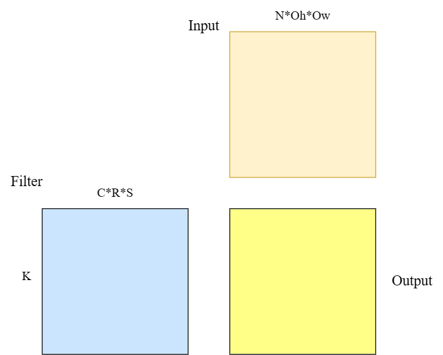
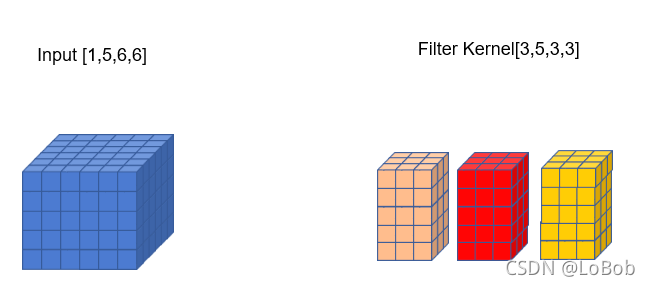
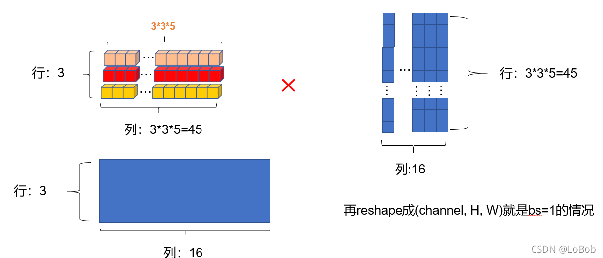
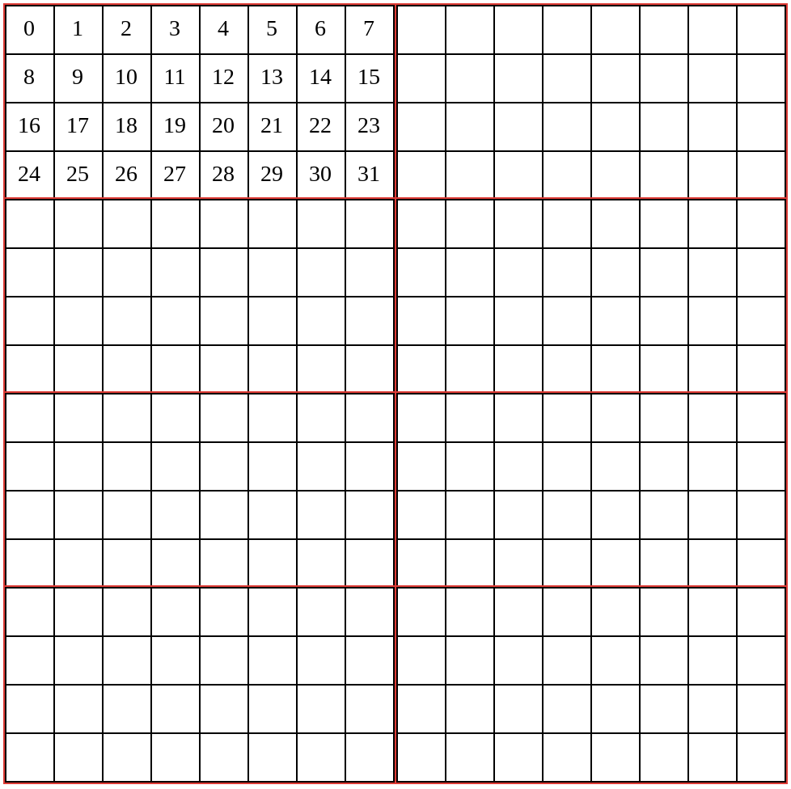
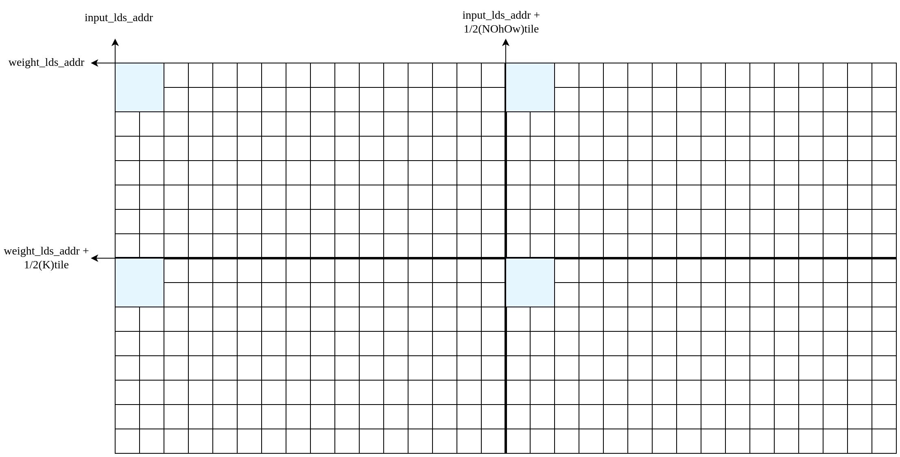
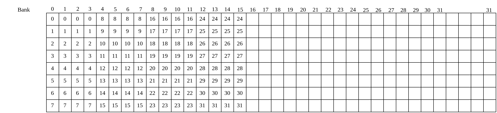
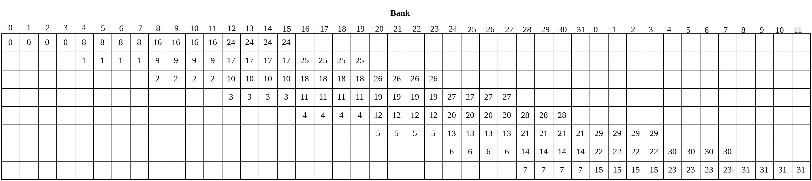
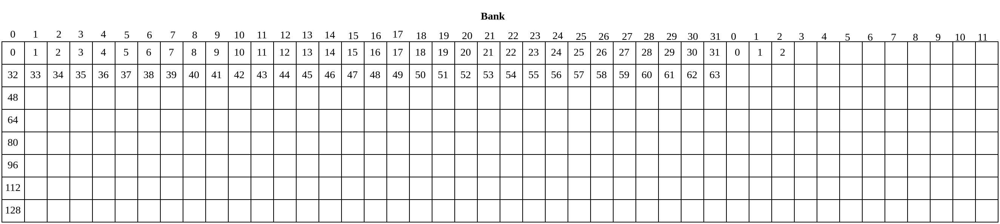
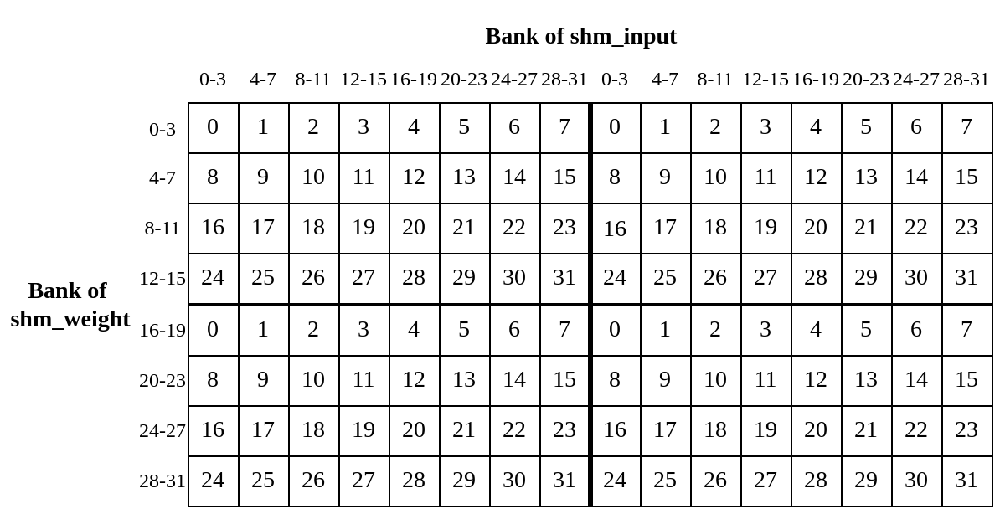

# **Implicit** GEMM 的CUDA实现与优化技巧

## 一、算法概览

Implicit GEMM是一种用于实现卷积操作的方法，与Img2col+GEMM相似，同样利用了矩阵乘法的性质来加速卷积计算。不同点在于，在内存使用量方面，Implicit GEMM不需要任何额外的存储空间。

在Img2col+GEMM实现中，实现的步骤为：

1.输入输出矩阵转换，用另一块内存空间保存转换后的输入输出矩阵。

2.将输入输出矩阵进行GEMM运算，然后进行输出。

而在 Implicit GEMM中，矩阵转换发生在计算中，也就不需要内存来保存转换后的矩阵，而是在GEMM中进行输入输出的坐标映射，从而实现卷积运算。




​		

如果把上图中的Filter作为Matrix1, Input作为Matrix2，那么GEMM可以变成这样来实现卷积：

``` c++
for (int i = 0; i < K; i++) {
    for (int j = 0; j < N*Oh*Ow; j++) {
        output[i][j] =0;
        for (int k = 0; k < C*R*S; k++) {
          result[i][j] += filter[i][k] * input[k][j];
        }
    }
}
```

这个矩阵乘已经可以实现卷积运算，但是注意到Input、Filter和Output并不是二维数据（如果没有经过Im2col转换），这时就要进行坐标变换。

现在假设Input的数据排列格式为NCHW，Filter为KCRS，则输出为NKOhOw，卷积步长为STRIDE。

- **Output坐标映射**

按照GEMM来说，Output由i和j两个循环变量决定，则应由这两个变量计算出N  K Oh Ow四个方向的坐标。

```C++
n = j  /（Oh*Ow）                       //N维度坐标
k = i                                  //K维度坐标
oh = ( j %（Oh*Ow）) / Ow               //Oh维度坐标
ow = ( j %（Oh*Ow）) % Ow               //Ow维度坐标
```

- **Filter坐标映射**

```c++
k = i                                  //K维度坐标
c = k / (R*S)                          //C维度坐标
r = k % (R*S) / S                      //R维度坐标
s = k % (R*S) % S                      //S维度坐标
```

- **Input坐标映射**

``` c++
n = j  /（Oh*Ow）                       //N维度坐标
c = k / (R*S)                          //C维度坐标
h = oh * STRIDE + r                    //H维度坐标
w = ow * STRIDE + s                    //W维度坐标
```

我们重写GEMM实现的卷积算法：

```c++
//Implicit GEMM Convolution

for (int i = 0; i < K; i++) {
    for (int j = 0; j < N*Oh*Ow; j++) {
        int on = j/(Oh*Ow);                    //N维度坐标
        int oh = (j%(Oh*Ow))/Ow;               //Oh维度坐标
        int ow = (j%(Oh*Ow))%Ow;               //Ow维度坐标
        output[on][i][oh][ow] =0;
        for (int k = 0; k < C*R*S; k++) {
            int ic = k/(R*S);                  //C维度坐标
            int ir = k%(R*S)/S;                //R维度坐标
            int is = k%(R*S)%S;                //S维度坐标
            int ih = oh*STRIDE + ir;           //H维度坐标
            int iw = ow*STRIDE + is;           //W维度坐标
            output[on][i][oh][ow] += filter[i][ic][ir][is] * input[on][ic][ih][iw];
        }
    }
}
```







## 二、**CUDA实现**

==参数介绍==

```c
unsigned int n = param.n;			// batch
unsigned int c = param.c;			// channel
unsigned int h = param.h;			// height
unsigned int w = param.w;			// width
unsigned int k = param.k;			// kernel num
unsigned int r = param.r;			// kernel size[0]
unsigned int s = param.s;			// kernel size[1]
unsigned int u = param.u;			// stride 1 
unsigned int v = param.v;			// stride 2 
unsigned int p = param.p;			// padding 1
unsigned int q = param.q;			// padding 2

oh = (h - r + 2 * p) / u + 1
ow = (w - s + 2 * q) / v + 1
```


###  线程任务划分

先简单介绍下流程：

```shell
--ldg + sts 阶段 ，从HBG里加载数据到shared memory;
--lds 阶段，从shared memory读取计算使用的数据;
--compute 阶段，计算数据；
```

==threadblock level==

```c++
int blockx = (param.Oh * param.Ow + 16) / 16 ;
int blocky = (param.k + 16) / 16;
int blockz = param.n;
int threadx = 256;         // 这里把 threadx 和 thready 两个维度合并了，方便处理
int thready = 1;
int threadz = 1;
```

我们知道ImplGemm任务是计算一个GEMM任务。

$M_{weight}M_{input} = M_{output}$

$M_{weight} \in R^{k \times crs}, M_{input} \in R^{crs \times NOhOw}, M_{output} \in R^{k \times NOhOw}$

同时，常规的引用 shared memory 来减少对HBG的访问。每个threadblock需要维护两个共享内存数组。

```c++
__shared__ float shInput[16][16];
__shared__ float shWeight[16][16];
int inputOffset = z * param.h * param.w * param.c;
int weightOffset = y * param.c * param.kh * param.kw;

for (int i = 0; i < rcs; i += 16){
    int weightOffsetTmp = i + tx;	
    shWeight[ty][tx] = param.weight[weightOffset + weightOffsetTmp];
    int cur_c = (i + ty) / kernel_size;
    int cur_kh = ((i + ty) % kernel_size) / param.kw;
    int cur_kw = ((i + ty) % kernel_size) % param.kw;
    int curH = posh_ori + cur_kh;
    int curW = posw_ori + cur_kw;
    int inputOffsetTmp = cur_c * intput_size + curH * param.w + curW;
    shInput[ty][tx] = param.input[inputOffsetTmp + inputOffset];
}
```

类似的技巧，我们把主循环划分为 $rcs_{tile} =  16$ 来避免shared memory过大。

根据上面的参数，

1. 每个线程块会负责计算 $ M_{output'} \in R^{128 * 1 * 128} $ 大小的结果矩阵。
2. 每个线程会负责 $ M_{output'} \in R^{1 * 1 * 1} $ 大小的结果矩阵。
3. 每个线程会负责加载 $shmInput[ty][tx] 和 shmWeight[ty][tx]$。

【此处应该有图】

==warp tile==



如上图所示，红框所示为一个线程束。我们把threadblock(16, 16) 划分为 4 * 2 个形状为【4, 8】的warp tile。横轴对应着维度 Oh * Ow，而纵轴对应着 k。

```c++
// warp tile
const uint32_t warp_id = threadIdx.x / 32;
const uint32_t lane_id = threadIdx.x % 32;
const uint32_t mma_tid_x = lane_id % 8;
const uint32_t mma_tid_y = lane_id / 8;

// 每个线程需要负责一个计算 1 * 1 的矩阵
uint32_t input_lds_addr = (warp_id % 2) * 8 + mma_tid_x ;
uint32_t weight_lds_addr = (warp_id / 2) * 4 + mma_tid_y ;

// output offset
int y = weight_lds_addr + by * 16;
int x = input_lds_addr + bx * 16;
```

据此，我们每个线程需要计算的结果矩阵 $M_{output}[n][y[x]$。并不影响每个线程sts阶段的过程，仍然是负责加载$shmInput[ty][tx] 和 shmWeight[ty][tx]$。主要是对lds阶段的影响。

**为什么使用warp tile?**

注意观察，一个warp的线程lds阶段访问共享内存的大小，

$访问次数 = 访问shm\_input次数 + 访问shm\_weight次数 = O(warpx + warpy)$

也就是说 warpx + warpy 值越低时，lds消耗的时间越小。显然 warpx = 4, warpy =8 要远比 warpx = 2, warpy = 16好得多。

==thread level==

首先我们来分析一下每个线程块的计算访存比，

$计算量 = N Oh Ow_{tile} * K_{tile} * CRS * 2flops$

$访存量 = （NOhOw_{tile} + K_{tile}）* RCS * 4Bytes$

$计算访存比 = \frac{NOhOw_{tile} * K_{tie}}{2(NOhOw_{tile} + K_{tie})}$

众所周知，计算访存比越大内存访问时间越容易被掩盖。所以，我们必须想办法增大计算访存比。根据上面的公式，增大 $NOhOw_{tile} 和 K_{tie}$，而 $NOhOw_{tile} 和 K_{tile}$其实就是每个线程块计算的结果矩阵的纵轴和横轴大小。

在不改变线程块内线程数量的情况，可以使每个线程处理的数据增多来使之增大。

我们可以让每个线程计算 4 * 4 甚至是 8 * 8 大小的结果矩阵，这里以 8 * 8 大小为例说明。

```tcl
int blockx = (param.Oh * param.Ow + 127) / 128 ;
int blocky = (param.k + 127) / 128;
int blockz = param.n;
int threadx = 256;         
int thready = 1;
int threadz = 1;
N * Oh * Ow）tile = (K)tile = 128, (CRS)tile = 8.
/*
	每个线程块负责计算 形状为 【16 * 8 , 16 * 8】的结果矩阵；
	每个线程需要负责计算 形状为 【8, 8】 的结果矩阵，同时需要加载 （8 * 128 / 256）* 2 = 8 个数据到
	共享内存中。
*/
```

```c++
// warp tile
const uint32_t warp_id = threadIdx.x / 32;
const uint32_t lane_id = threadIdx.x % 32;
const uint32_t mma_tid_x = lane_id % 8;
const uint32_t mma_tid_y = lane_id / 8;

// 每个线程需要负责一个 8 * 8 的矩阵， 实际上这里划分为 4个 4 * 4 的矩阵
uint32_t input_lds_addr = (warp_id % 2) * (8 * 8) + mma_tid_x * 4 ;
uint32_t weight_lds_addr = (warp_id / 2) * (8 * 4) + mma_tid_y * 4;

// share memory buffer, 每个线程需要负责加载 4 * 2 数据
__shared__ float shm_weight[8 * 128];    // 列主序 shm_weight[4][32][8]
__shared__ float shm_input[128 * 8];   // 行主序 shm_input[8][4][32]

uint32_t weight_sts_addr = (tx % 8) * 128 + (tx / 8) * 4 ; // shm_weight[:4][tx/8][tx%8]
uint32_t input_sts_addr = (tx / 32) * 128 + (tx % 32);  // shm_input[tx/32][:4][tx%32]
```

- sts阶段，分别加载input和weight矩阵的4个元素到共享内存。对应在shm_input和shm_weight中的位置，由input_sts_addr和weight_sts_addr提供。

- lds阶段，需要注意的是每个线程计算的并不是一个完整的子矩阵，而是由四个小矩阵组成。(这里以每个线程处理4*4为例作图，不然太大了放不下)还有这里之所以这样处理，完全是因为lds阶段导致Bankconflict需要解决，这里暂不展开。

  

### 解决可能出现的Bankconflict

==sts阶段==

**shm_weight**

首先看一下，现在使用的方法，

```c++
__shared__ float shm_weight[8 * 128];    // 列主序 shm_weight[4][32][8]
uint32_t weight_sts_addr = (tx % 8) * 128 + (tx / 8) * 4 ; // shm_weight[:4][tx/8][tx%8]
```



显然这会出现多次bankconflict,可以使用**padding**来解决。

```c++
__shared__ float shm_weight[8 * 132];    // 列主序 shm_weight[4][32][8]
uint32_t weight_sts_addr = (tx % 8) * 132 + (tx / 8) * 4 ; // shm_weight[:4][tx/8][tx%8]
```



图中显示了**warp 0**的访存布局，可以划分为4次内存访问【0-7，8-15， 16-23， 24-31】，不再会出现bankconflict。其实我不太清楚，这些内存访问会用什么算法来决单次访问那些数据。不过上述图中，肯定在存在着这样的方法，不会出现bankconflict。

(按我的理解，这里不出现bankconflict，必须要使用float4来加载内存，不然并不能解决bankconflict.)

**shm_input**

首先看一下，现在使用的方法，

```C++
__shared__ float shm_input[128 * 8];   // 行主序 shm_input[8][4][32]
uint32_t input_sts_addr = (tx / 32) * 128 + (tx % 32);  // shm_input[tx/32][:4][tx%32]
```



如图，展示了第一个warp线程的第一个访问请求的情况。类似的也可在表中标注，很明显不存在Bankconflict.

```c++
int cur_c = (crs + tx / 32) / weight_channel_size;
        int cur_ih = ((crs + tx / 32) % weight_channel_size) / param.kw;
        int cur_iw = ((crs + tx / 32) % weight_channel_size) % param.kw;
        #pragma unroll
        for (int i = 0; i < 4; i++) {
            int cur_h = pos_ori_h[i] + cur_ih;
            int cur_w = pos_ori_w[i] + cur_iw;
            int input_offset_tmp = cur_c * input_channel_size + cur_h * param.w + cur_w;

            if (cur_h >= 0 && cur_w >= 0 && cur_h < param.h && cur_w < param.w) {
                // shm_input[input_sts_addr + i * 32] = param.input[input_offset_tmp + input_offset];
                input_ldg_reg[i] = param.input[input_offset_tmp + input_offset];
            }
            else {
                input_ldg_reg[i] = 0.0;
            }
        }

```

(这里显然无法使用float4，也不会出现bankconflict.)

==lds阶段==

```c++
// 每个线程需要负责一个 8 * 8 的矩阵， 实际上这里划分为 4个 4 * 4 的矩阵
uint32_t input_lds_addr = (warp_id % 2) * (8 * 8) + mma_tid_x * 4 ;
uint32_t weight_lds_addr = (warp_id / 2) * (8 * 4) + mma_tid_y * 4;

// 计算数据
// 读取share memory到reg
#pragma unroll
for (int subcrs = 0; subcrs < 8; subcrs++) {
    #pragma unroll
    for (int i = 0; i < 4; i++)
    {
        weight_temp[i] = shm_weight[weight_lds_addr + subcrs * 132 + i];
        weight_temp[i + 4] = shm_weight[weight_lds_addr + subcrs * 132 + i + 16];
    }
    #pragma unroll
    for (int i = 0; i < 4;i++)
    {
        input_temp[i] = shm_input[input_lds_addr + subcrs * 128 + i];
        input_temp[i + 4] = shm_input[input_lds_addr + subcrs * 128 + i + 32];
    }

    // 转换为外积
    #pragma unroll
    for (int i = 0; i < 8; i++) {
        #pragma unroll
        for (int j = 0; j < 8; j++) {
            if (i == 0 && j == 0     && weight_lds_addr + by * 128 == 0 && input_lds_addr + bx * 128 == 0){
                printf("step %d : %f += %f * %f\n",subcrs + crs, output_temp[i][j], input_temp[j] , weight_temp[i]);
            }
            output_temp[i][j] += weight_temp[i] * input_temp[j];

        }
    }
}
```



如图是 $subcrs = 0$ 时的情况，需要注意的是当 $subcrs$ 变化时，Bank of shm_weight 会有着 $ 4 * subcrs $ 的偏移。当然，这不影响数据访问，都不会出现 Bank conflict 的情况。


### Double buffering

双缓冲共享内存，可以通过使用计算时间掩盖掉除第一次ldg的时间之外的内存访问时间。我感觉这个技术很常见，不再介绍原理。会着重介绍下实现的细节以及需要注意的问题。

```c++
// share memory buffer, 每个线程需要负责加载 4 * 2 数据
__shared__ float shm_weight[2][8 * 132];    // 列主序 shm_weight[4][32][8]
__shared__ float shm_input[2][128 * 8];   // 行主序 shm_input[8][4][32]

// 分离 ldg 和 sts
float weight_ldg_reg[4];
float input_ldg_reg[4];

/*
	先预加载一个数据 
*/
// 加载数据 
// ldg stage
int crs = 0;
int weight_offset_tmp = crs + tx % 8;
#pragma unroll
for (int i = 0; i < 4; i++)
{
    if ( weight_offset_tmp < kernel_size && by * 128 + tx / 8 * 4 + i < param.k ) {
        weight_ldg_reg[i] = param.weight[weight_offset + weight_offset_tmp + i * kernel_size];
    } 
    else {
        weight_ldg_reg[i] = 0.0;
    }   
    // weight_ldg_reg[i] = param.weight[weight_offset + weight_offset_tmp + i * kernel_size]; // 不清楚为什么不判断越界也可以
}

int cur_c = (crs + tx / 32) / weight_channel_size;
int cur_ih = ((crs + tx / 32) % weight_channel_size) / param.kw;
int cur_iw = ((crs + tx / 32) % weight_channel_size) % param.kw;
#pragma unroll
for (int i = 0; i < 4; i++) {
    int cur_h = pos_ori_h[i] + cur_ih;
    int cur_w = pos_ori_w[i] + cur_iw;
    int input_offset_tmp = cur_c * input_channel_size + cur_h * param.w + cur_w;

    if (cur_h >= 0 && cur_w >= 0 && cur_h < param.h && cur_w < param.w) {
    // shm_input[input_sts_addr + i * 32] = param.input[input_offset_tmp + input_offset];
        input_ldg_reg[i] = param.input[input_offset_tmp + input_offset];
    }
    else {
        input_ldg_reg[i] = 0.0;
    }
}

// sts
for (int i = 0; i < 4; i++){
    shm_input[0][input_sts_addr + i * 32] = input_ldg_reg[i];
    shm_weight[0][weight_sts_addr + i] = weight_ldg_reg[i];
}
__syncthreads();

//lds stage , for subcrs = 0, crs = 0
#pragma unroll
for (int i = 0; i < 4; i++) {
    input_temp[0][i] = shm_input[0][input_lds_addr + i];
    input_temp[0][i + 4] = shm_input[0][input_lds_addr + i + 32];
}
#pragma unroll
for (int i = 0; i < 4; i++) {
    weight_temp[0][i] = shm_weight[0][weight_lds_addr + i];
    weight_temp[0][i + 4] = shm_weight[0][weight_lds_addr + i + 16];
}

// 主循环，注意每个循环内 负责一个 CRS tile 的计算，以及下一个循环需要的数据ldf + sts + (下个循环第一个lds使用的)
// 
// main loop
for (crs = 0; crs < kernel_size; crs += 8) {
    // 加载数据 
    // ldg stage
    //	...,参考上面
    
    // lds + compute 
	int load_flag = write_flag ^ 1; // 对应这个循环计算使用的数据标志位
    #pragma unroll
    for (int subcrs = 0; subcrs < 8 - 1; subcrs++) {
        // lds下个循环使用的数据
        #pragma unroll
        for (int i = 0; i < 4; i++) {
            weight_temp[(subcrs + 1) % 2][i] = shm_weight[load_flag][weight_lds_addr + (subcrs + 1) * 132 + i]; 
            weight_temp[(subcrs + 1) % 2][i + 4] = shm_weight[load_flag][weight_lds_addr + (subcrs + 1) * 132 + i + 16]; 
        }

        #pragma unroll
        for (int i = 0; i < 4; i++) {
            input_temp[(subcrs + 1) % 2][i] = shm_input[load_flag][input_lds_addr + (subcrs + 1) * 128 + i]; 
            input_temp[(subcrs + 1) % 2][i + 4] = shm_input[load_flag][input_lds_addr + (subcrs + 1) * 128 + i + 32];
        }

        // compute
        #pragma unroll
        for (int i = 0; i < 8; i++) {
            #pragma unroll
            for (int j = 0; j < 8; j++) {
                output_temp[i][j] += input_temp[subcrs % 2][j] * weight_temp[subcrs % 2][i];
            }
        }
    }
    
    /*
            上面其实还有一个循环没有计算，这里在前面塞了一个sts阶段掩藏延迟，和main loop外的sts一样的，为下一个 lds + compute 
            第一个循环计算预加载数据。
    */
    for (int i = 0; i < 4; i++)
    {
        shm_weight[write_flag][weight_sts_addr + i] = weight_ldg_reg[i];
        shm_input[write_flag][input_sts_addr + i * 32] = input_ldg_reg[i];
    }

    __syncthreads();  // 必须等待数据加载完成，不然lds会出错

    write_flag = write_flag ^ 1;

    // lds下个循环使用的数据
    #pragma unroll
    for (int i = 0; i < 4; i++) {
        weight_temp[0][i] = shm_weight[load_flag ^ 1][weight_lds_addr + i]; 
        weight_temp[0][i + 4] = shm_weight[load_flag ^ 1][weight_lds_addr + i + 16]; 
    }

    #pragma unroll
    for (int i = 0; i < 4; i++) {
        input_temp[0][i] = shm_input[load_flag ^ 1][input_lds_addr + i]; 
        input_temp[0][i + 4] = shm_input[load_flag ^ 1][input_lds_addr + i + 32];
    }

    /*
            好啦，终于可以把 当前循环最后一个subcrs的数据计算完了.
            subcrs = 7
   */
    #pragma unroll
    for (int i = 0; i < 8; i++) {
        #pragma unroll
        for (int j = 0; j < 8; j++) {
            output_temp[i][j] += input_temp[1][j] * weight_temp[1][i];
        }
    }
}
```

代码有点长，但是很好理解。需要注意的是，每次提前 ldg + sts 下个循环需要的数据，需要存放在write_flag对应的位置。每次循环中 lds + compute，使用的是上次循环加载的数据，对应的write_flag ^ 1对应的位置。每次ldg + sts，必须等待所有线程完成，才能继续执行下面的代码。

一些有趣技巧，需要留意：

- ldg 和 sts 分离，提高内存访问效率。避免sts指令等待ldg指令导致的bubble；

- warp tile可以使用z字排布，更有利于数据的广播。（说实话，没看懂，即使不Z字排布仍旧可以广播）

  ```c++
  // warp tile, z字排布
  const uint32_t warp_id = threadIdx.x / 32;
  const uint32_t lane_id = threadIdx.x % 32;
  const uint32_t mma_tid_x = (lane_id / 2) % 8;
  const uint32_t mma_tid_y = (lane_id / 16) * 2 + (lane_id % 2);
  
  // 每个线程需要负责一个 8 * 8 的矩阵， 实际上这里划分为 4个 4 * 4 的矩阵
  uint32_t input_lds_addr = (warp_id % 2) * (8 * 8) + mma_tid_x * 4 ;
  uint32_t weight_lds_addr = (warp_id / 2) * (8 * 4) + mma_tid_y * 4;
  int y = weight_lds_addr + by * 128;
  int x = input_lds_addr + bx * 128;
  ```

  


