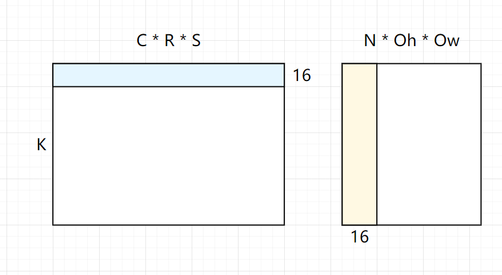
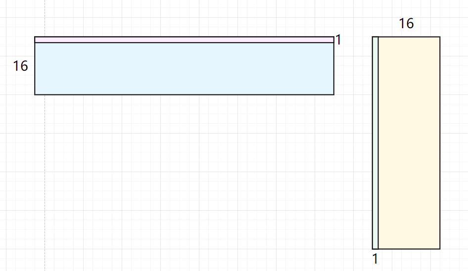
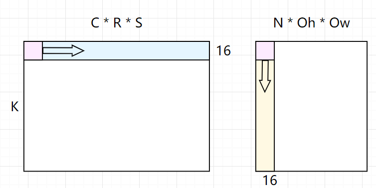
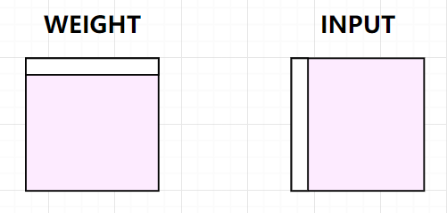

# **Implicit** GEMM 的CUDA实现与优化技巧

## 一、算法概览

Implicit GEMM是一种用于实现卷积操作的方法，与Img2col+GEMM相似，同样利用了矩阵乘法的性质来加速卷积计算。不同点在于，在内存使用量方面，Implicit GEMM不需要任何额外的存储空间。

在Img2col+GEMM实现中，实现的步骤为：

1.输入输出矩阵转换，用另一块内存空间保存转换后的输入输出矩阵。

2.将输入输出矩阵进行GEMM运算，然后进行输出。

而在 Implicit GEMM中，矩阵转换发生在计算中，也就不需要内存来保存转换后的矩阵，而是在GEMM中进行输入输出的坐标映射，从而实现卷积运算。


​		

如果把上图中的Filter作为Matrix1, Input作为Matrix2，那么GEMM可以变成这样来实现卷积：

``` c++
for (int i = 0; i < K; i++) {
    for (int j = 0; j < N*Oh*Ow; j++) {
        output[i][j] =0;
        for (int k = 0; k < C*R*S; k++) {
          result[i][j] += filter[i][k] * input[k][j];
        }
    }
}
```

这个矩阵乘已经可以实现卷积运算，但是注意到Input、Filter和Output并不是二维数据（如果没有经过Im2col转换），这时就要进行坐标变换。

现在假设Input的数据排列格式为NCHW，Filter为KCRS，则输出为NKOhOw，卷积步长为STRIDE。

- **Output坐标映射**

按照GEMM来说，Output由i和j两个循环变量决定，则应由这两个变量计算出N  K Oh Ow四个方向的坐标。

```C++
n = j  /（Oh*Ow）                       //N维度坐标
k = i                                  //K维度坐标
oh = ( j %（Oh*Ow）) / Ow               //Oh维度坐标
ow = ( j %（Oh*Ow）) % Ow               //Ow维度坐标
```

- **Filter坐标映射**

```c++
k = i                                  //K维度坐标
c = k / (R*S)                          //C维度坐标
r = k % (R*S) / S                      //R维度坐标
s = k % (R*S) % S                      //S维度坐标
```

- **Input坐标映射**

``` c++
n = j  /（Oh*Ow）                       //N维度坐标
c = k / (R*S)                          //C维度坐标
h = oh * STRIDE + r                    //H维度坐标
w = ow * STRIDE + s                    //W维度坐标
```

我们重写GEMM实现的卷积算法：

```c++
//Implicit GEMM Convolution

for (int i = 0; i < K; i++) {
    for (int j = 0; j < N*Oh*Ow; j++) {
        int on = j/(Oh*Ow);                    //N维度坐标
        int oh = (j%(Oh*Ow))/Ow;               //Oh维度坐标
        int ow = (j%(Oh*Ow))%Ow;               //Ow维度坐标
        output[on][i][oh][ow] =0;
        for (int k = 0; k < C*R*S; k++) {
            int ic = k/(R*S);                  //C维度坐标
            int ir = k%(R*S)/S;                //R维度坐标
            int is = k%(R*S)%S;                //S维度坐标
            int ih = oh*STRIDE + ir;           //H维度坐标
            int iw = ow*STRIDE + is;           //W维度坐标
            output[on][i][oh][ow] += filter[i][ic][ir][is] * input[on][ic][ih][iw];
        }
    }
}
```


## 二、**CUDA实现**

==参数介绍==

```c
unsigned int n = param.n;			// batch
unsigned int c = param.c;			// channel
unsigned int h = param.h;			// height
unsigned int w = param.w;			// width
unsigned int k = param.k;			// kernel num
unsigned int r = param.r;			// kernel size[0]
unsigned int s = param.s;			// kernel size[1]
unsigned int u = param.u;			// stride 1 
unsigned int v = param.v;			// stride 2 
unsigned int p = param.p;			// padding 1
unsigned int q = param.q;			// padding 2

oh = (h - r + 2 * p) / u + 1
ow = (w - s + 2 * q) / v + 1
```

### 2.1 *ImplGEMM_0 naive-blocked GEMM*  

首先划分每个线程的任务，参数如下：

```c++
int blockx =  ((outh * outw + 15) / 16); // blockx  number
int blocky = (k + 15) / 16;           // blocky  number
int blockz = n;                       // blockz  number
int threadx = 16;                     // threadx number per block
int thready = 16;                     // thready number per block
int threadz = 1;                      // threadz number per block
dim3 block(threadx, thready,threadz);
dim3 grid(blockx, blocky,blockz);
implgemm<<<grid,block>>>(param);
```

可以看出，每个线程块负责的运算部分为：



每个线程负责的计算部分为：




**核函数实现**

``` c++
__global__ void implgemm(param_t param)
{

    int x = blockIdx.x * blockDim.x + threadIdx.x;
    int y = blockIdx.y * blockDim.y + threadIdx.y;
    int z = blockIdx.z;

    if (x >= param.Oh * param.Ow || y >= param.k || z >= param.n)
    {
        return;
    }

    // 当前线程处理的数据点在oh、ow上的坐标
    int posOh = x / param.Ow;
    int posOw = x % param.Ow;

    int posh_ori = posOh * param.u - param.p;
    int posw_ori = posOw * param.v - param.q;

    float sum = 0.0;

    int inOffset = z * param.c * param.h * param.w + posh_ori * param.w + posw_ori;
    int weiOffset = y * param.c * param.r * param.s;
    int inChannelOffset = param.h * param.w;
    int weightChannelOffset = param.r * param.s;

    for (int i = 0; i < param.r; i++)
    {
        for (int j = 0; j < param.s; j++)
        {
            int posh_real = posh_ori + i;
            int posw_real = posw_ori + j; 

            if (posh_real >= 0 && posw_real >= 0 && posw_real < param.w && posh_real < param.h)
            {
                int inOffsetTmp = inOffset;
                int weiOffsetTmp = weiOffset;
                for (int channel = 0; channel < param.c; channel++)
                {
                    sum += param.input[inOffsetTmp + i * param.w + j] * param.weight[weiOffsetTmp + i * param.s + j];
                    inOffsetTmp += inChannelOffset;
                    weiOffsetTmp += weightChannelOffset;
                }
            }
        }
    }

    // 计算输出偏移
    int outOffset = z * param.k * param.Oh * param.Ow + y * param.Oh * param.Ow + x;
    param.output[outOffset] = sum;
}
```


### 2.2 *ImplGEMM_1 Thread-blocked GEMM*

线程划分保持不变，但是引入了**共享内存**来减少重复内存的读取。为了方便后续的优化，我们首先把CRS循环恢复为一个完整的循环。

kernel 函数如下：

``` c++
__global__ void implgemm_kernel_2(param_t param) {

    int x = blockIdx.x * blockDim.x + threadIdx.x;
    int y = blockIdx.y * blockDim.y + threadIdx.y;
    int z = blockIdx.z;

    if (x >= param.Oh || y >= param.k || z >= param.n) {
        return;
    }

    int oh = x / param.Ow;
    int ow = x % param.Ow;
    int posh_ori = oh * param.stride_h - param.pad_h;
    int posw_ori = ow * param.stride_w - param.pad_w;

    float sum = 0.0;

    int inputOffset = z * param.h * param.w * param.c;
    int weightOffset = y * param.c * param.kh * param.kw;

    int intput_size = param.h * param.w;
    int kernel_size = param.kh * param.kw;

    for (int i = 0; i < param.kh * param.kw * param.c; i++) {

        int weightOffsetTmp = i;
        int cur_c = i / kernel_size;
        int cur_kh = (i % kernel_size) / param.kw;
        int cur_kw = (i % kernel_size) % param.kw;
        int curH = posh_ori + cur_kh;
        int curW = posw_ori + cur_kw;
        int inputOffsetTmp = cur_c * intput_size + curH * param.w + curW;

        if (curH >= 0 && curW >= 0 && curH < param.h && curW < param.w)
        {
            sum += param.input[inputOffsetTmp + inputOffset] * param.weight[weightOffsetTmp + weightOffset];
        }

    }

    // 计算输出偏移
    int outOffset = z * param.k * param.Oh * param.Ow + y * param.Oh * param.Ow + x;
    param.output[outOffset] = sum;

}
```

接下来，我们对每个Block设置了两个Shared Memory Buffer来暂存读取的数据。



如图，每个Thread Block会负责类似的 蓝色矩阵和橙色矩阵的乘积任务。 于是我们将这个乘积划分为若干个 粉红色矩阵乘积 的和形式，经过若干次迭代相加得到最终的结果。**每次迭代中，线程块内的每个线程都负责将数据加载到共享内存， 并从共享内存读取数据， 计算两个向量的向量积。**



**计算次数** ：

 $N * K * C * R * S * Oh * Ow $

**访存次数** ：

线程块数 * 每个线程块需要訪存的次数 =  $\frac{K}{tilex} * \frac{N * Oh *Ow}{tiley} * (tiley * CRS + tilex *CRS)=\frac{tilex + tiley}{tilex * tiley} * N * K * Oh * Ow * CRS$

**kernel 函数**

``` 

```


## 2.3 *ImplGEMM_2 (warp-level)*

