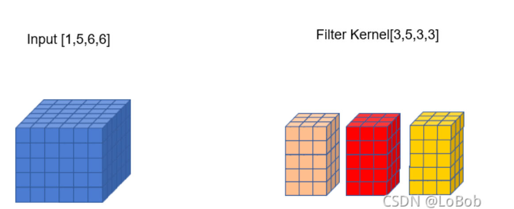

# Implicit GEMM 的CUDA实现与优化技巧

Implicit GEMM是一种用于实现卷积操作的方法，与Img2col+GEMM相似，同样利用了矩阵乘法的性质来加速卷积计算。不同点在于，在内存使用量方面，Implicit GEMM不需要任何额外的存储空间。

在Img2col+GEMM实现中，实现的步骤为：

1.输入输出矩阵转换，用另一块内存空间保存转换后的输入输出矩阵。

2.将输入输出矩阵进行GEMM运算，然后进行输出。

而在 Implicit GEMM中，矩阵转换发生在计算中，也就不需要内存来保存转换后的矩阵，而是在GEMM中进行输入输出的坐标映射，从而实现卷积运算。